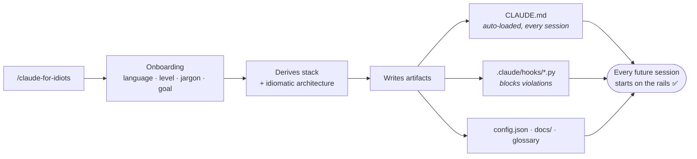

<div align="center">

# 🚲 claude-for-idiots

**Guard-rails + plain language for [Claude Code](https://claude.com/claude-code).**

*A Claude Code skill that keeps Claude **on the rails** — and explains things in plain
language, so even a total beginner can build real software without getting lost.*

[](https://github.com/JulioBarbosaS/Claude-For-Idiots/actions/workflows/ci.yml)
[](CHANGELOG.md)
[](LICENSE)
[](https://claude.com/claude-code)
[](CONTRIBUTING.md)

**English** · [Português](README.pt-br.md)

</div>

---

## ⚡ Quickstart

[](https://claude.com/claude-code)


**1. Install (once)**

 

```bash
git clone https://github.com/JulioBarbosaS/Claude-For-Idiots.git ~/.claude/skills/claude-for-idiots
```


```powershell
git clone https://github.com/JulioBarbosaS/Claude-For-Idiots.git "$env:USERPROFILE\.claude\skills\claude-for-idiots"
```

Then **restart Claude Code** so it picks up the new skill.

**2. Turn it on — per project, explicitly**

```
/claude-for-idiots
```

**3. Update, whenever a new version lands**

```
/claude-for-idiots update
```

Updates the skill *and* — if the current project was configured by it — the
project's guard-rails, **keeping every choice you made**. It tells you what
changed before touching anything.

<details>
<summary><b>📌 Before you run it — three honest heads-ups</b></summary>

<br>

| | |
|---|---|
| ⏱️ **Setup takes ~10 min** | It asks the questions, picks the stack, installs tooling and writes the guard-rails. Measured on Opus 4.8. |
| 🤖 **Beginners: use auto mode** | Run Claude Code with auto-accept permissions *during setup*, so you're not interrupted at every step. |
| 🚧 **Deploy isn't covered yet** | The skill covers local development. Deploy workflows are on the roadmap. |

</details>

---

## 🤔 What is this? (in plain words)

You're building something with Claude Code, but:

- it keeps using words you don't understand (and don't feel like looking up), and
- you're not totally sure it's doing things *"the right way"*.

This skill fixes both. When you turn it on, Claude:

- 🗣️ **talks to you the way *you* choose** — no jargon at all, jargon *with* simple
  explanations, or jargon as usual;
- 🧱 **follows good engineering habits automatically** — tests, safe commits, a real
  folder structure, no leaked passwords — so your project doesn't turn into a mess.

You don't need to know what *"migration"*, *"CORS"* or *"architecture"* mean.
**That's the whole point.** Beginners and experienced devs both use it — it just adapts.

<details>
<summary><b>💬 What it actually sounds like</b></summary>

<br>

**Term mode `none`** — never any jargon:

> I set things up so your passwords stay in a private file on your computer that
> never leaves it. I also added an example file with just the *names* of those
> settings, so anyone helping you knows what to fill in.

**Term mode `explain`** — the term, then the explanation, getting deeper as you learn:

> I put the credentials in a gitignored `.env` — that's a file with your secrets that
> Git is told to ignore, so it never gets uploaded — plus a committed `.env.example`
> listing only the variable names.

**Term mode `raw`** — you already know; just give the guard-rails:

> Secrets in `.env` (gitignored), `.env.example` committed. Secret scan runs before push.

</details>

---

## 🧭 How it works

The skill is the **installer**, not a babysitter. It runs once and writes
**persistent artifacts** into your project — so the rules keep applying in every
future session, even long after the skill drops out of context.



| Artifact | Where it lands | What it does |
|---|---|---|
| 📜 **Rules + profile** | `CLAUDE.md` | Loaded automatically every session. Source of truth for behavior. |
| ⚙️ **Config** | `.claude-for-idiots/config.json` | Machine-readable answers from onboarding. Read by the hooks. |
| 📖 **Glossary** | `.claude-for-idiots/glossary.json` | Tracks which terms were explained, so explanations level up instead of repeating. |
| 🛡️ **Hooks** | `.claude/hooks/*.py` | Technically enforce rules 1, 5 and 6 — they **block**, not just promise. |
| 🔌 **Hook wiring** | `.claude/settings.json` | Registers the hooks as `PreToolUse`. |
| 🧠 **Knowledge base** | `docs/INDEX.md` | Long-term memory on demand: decisions, bug investigations, API quirks. |

> **Why it only runs when you ask.** Not every project deserves guard-rails. A
> throwaway script, or an existing codebase with its own conventions, is usually
> better left alone. So the skill **never takes over by itself** — you switch it
> on, per project, when you actually want it.

---

## 🛡️ What it enforces

After setup, Claude follows these in **every** session of that project.
**🔒 Checked by a hook** = a script blocks the common violation paths — a safety
net, not a sandbox. See "Known limitations" for what still gets through.

| | Rule | What it means for you |
|---|---|---|
| 🔒 | **Never hand-edit migrations** | Uses the proper generator command instead of hand-patching your database history. |
| 🔒 | **New files stay in the architecture** | Nothing gets dumped at random. The folder structure survives. |
| 🔒 | **Secrets never reach the internet** | Keys/passwords stay in a local `.env`; anything that publishes gets scanned first. |
| | **Always writes tests** | Unit + integration — and it asks before running the slow full suite. |
| | **Commits per feature** | So you never lose progress. |
| | **Sanity check after each feature** | Lint → the feature's tests → actually booting the app to see it work. |
| | **Quality tooling for your stack** | Formatter + linter installed and wired up. No style debates. |
| | **Reuses before rebuilding** | Searches the codebase and `docs/` before writing the same thing twice. |
| | **Keeps a `docs/` brain** | Big decisions and hard-won lessons survive — without bloating every session. |
| | **Knows when to stop guessing** | After two failed fixes: re-read the error, check versions, research the web, *then* retry. |
| 🔒 | **Pauses on a new feature** | Lays out the hidden decisions as options to pick from before writing code. A bug fix, a visual tweak or a rename goes straight through. |
| | **Can check the browser itself** | For web apps: loads the page, reads the console for hidden errors, screenshots. *(Playwright — it offers to set it up.)* |

And it adapts to **you**:

- 🎚️ **Experience level** — `beginner` / `intermediate` / `advanced`: decides how much it
  explains and whether it picks the tech stack for you.
- 🗣️ **Technical terms** — `none` (plain language only) · `explain` (the term + a simple
  explanation that gets deeper as you learn) · `raw` (terms as usual).

---

## 🧰 What can I build with it?

The skill knows how to pick an idiomatic architecture for these project types.
**Advanced users always choose their own stack** — the catalog is just the default.

| What you want to build | Stack it recommends | Why |
|---|---|---|
| 🌐 Website / web app |    | SSR + routing built in; huge ecosystem |
| 📄 Simple static / content site |     | Fewest moving parts for a beginner |
| 🔌 REST API or backend service |     | FastAPI = gentle · Nest = structured TS |
| 🧩 Full-stack app (UI + API + DB) |    | One language (TS) end to end |
| 📱 Mobile app (iOS + Android) |  | Single codebase, strong tooling |
| ⌨️ CLI tool / automation script |   | Typer / Commander — tiny, no heavy layers |
| 📊 Data analysis / ML prototype |     | Pipeline-style, not app-style |
| 🤖 Discord / Telegram bot |     | discord.py / aiogram — small service |
| 🖥️ Desktop app |   | Tauri = lighter · Electron = more familiar |

> Adding a new one is **editing one data file** — see
> [`references/stack-catalog.md`](references/stack-catalog.md). No skill rewriting.

---

## ✅ Should you use it on your project?

Honest answer: **not always.** The guard-rails cost something — tests, checks and
commits on every feature — so they have to buy you more than they cost.

| Project | Use it? |
|---|---|
| A real app/site/API you'll keep working on (weeks, months) | ✅ **Yes** — the sweet spot |
| Your first serious project / learning by building something real | ✅ **Yes** — it was made for this |
| Anything with a database and/or a public repo | ✅ **Yes** — the migration and secret rules exist for exactly this |
| A quick throwaway script or one-afternoon experiment | ❌ **No** — plain Claude is faster; the overhead isn't worth it |
| An existing codebase with its own conventions / a team project | ❌ **Not yet** — the skill assumes a fresh project |

> 🧠 **Rule of thumb:** if the project will still matter in two weeks, turn it on.
> If it's disposable, don't.

---

## 🚧 Known limitations

Being upfront beats being surprised:

- **Windows hooks need a `python3` on PATH.** The generated `.claude/settings.json`
  calls `python3`; a python.org install only ships `python.exe` / `py.exe`. If the
  hook can't start, the guard-rails silently don't run — check with a deliberate
  violation after setup.
- **The hooks watch file tools, not the shell.** A file written via `Edit`/`Write`
  is checked against the architecture; the same file created with `cat > file` or
  `sed -i` is not. Only `Bash` commands that look like a *publish* step (`git push`,
  `npm publish`, `docker push`, …) get inspected.
- **The secret scanner is regex-based.** It reads tracked files, gitignored `.env`
  files on disk, and the commits about to be pushed — but it can't scrub something
  already pushed in an earlier commit, and it can false-positive on realistic test
  fixtures. Exempt those with `secrets.allowlist_paths` or a `# cfi:allow-secret`
  comment — never for a live credential.
- **Architecture enforcement goes by file extension and path glob.** A file with no
  extension at all (`Dockerfile`, `Makefile`) is never policed, by design.
- **Flutter:** platform config files (`AndroidManifest.xml`, `Info.plist`, …) are
  allowed, but native plugin code under `android/`/`ios/`/`macos/` (a new `.kt` or
  `.swift`, `project.pbxproj`) is still checked — on purpose, so a native layer
  can't quietly bypass the Dart architecture.
- **The feature pause (Rule 10) never sees your prompt, only the file being
  written.** Telling "new feature" from "bug fix" is Claude's judgment, not a
  script's. The hook catches one narrow case: a brand-new code file with no
  alignment recorded. A feature built entirely inside files that already exist
  passes with no pause, however large.
- **"Is this a test file?" is decided by filename and folder convention** (`tests/`,
  `foo_test.py`, `foo.spec.ts`, …), not by what the file does — deliberate, so
  Rule 10 never fights test-first development. A file that merely *looks* like a
  test is exempt the same way.
- **`secrets.allow_patterns` is Linux/macOS only.** A regex from the config can
  backtrack catastrophically and there is no way to interrupt one mid-run on
  Windows, so the field degrades to nothing there rather than risk stalling the
  hook; the block message says so. `secrets.allowlist_paths` and the
  `# cfi:allow-secret` pragma work everywhere.
- **Existing codebases and deploy workflows aren't covered yet.**

Hit one of these? [Open an issue](https://github.com/JulioBarbosaS/Claude-For-Idiots/issues) —
that's exactly how the catalogs get better.

---

## 🗂️ Repository layout

<details>
<summary><b>Expand the file tree</b></summary>

<br>

```
SKILL.md                      # the skill's brain (onboarding + behavior)
VERSION                       # current version, recorded into each project
references/                   # editable data — extend the skill HERE
  rules.md                    #   the 10 rules (source of truth)
  brainstorming.md            #   Rule 10: when to align, how to ask
  stack-catalog.md            #   objective → stack
  architecture-catalog.md     #   stack → idiomatic architecture
  onboarding-flow.md          #   the questions
  glossary-format.md          #   how the "explain" glossary works
  quality-tools.md            #   formatter / linter / type-checker per stack
  browser-verification.md     #   web smoke tests via a real browser
  update-flow.md              #   how /claude-for-idiots update works
assets/                       # what gets written into your project
  CLAUDE.template.md          #   the generated project guide
  config.example.json         #   the config shape the hooks read
  settings.template.json      #   hook wiring
  docs-INDEX.template.md      #   knowledge-base index
  ADR.template.md             #   architecture decision record
hooks/                        # the technical guard-rails (Python, stdlib only)
  block_migration_edits.py    #   Rule 1
  enforce_architecture.py     #   Rule 5
  scan_secrets_before_push.py #   Rule 6
  require_feature_alignment.py#   Rule 10
tests/                        # 193 tests — block / allow / fail-open / consistency
.github/workflows/ci.yml      # runs them on every push and PR
```

</details>

**Design principle:** *everything is meant to be edited.* Stacks, architectures and
rule text live in `references/` as **data**, not baked into prose. Teach the skill a
new stack by adding a table row — not by rewriting the skill.

---

## ❤️ Why I built this

I was coding with Claude Code and ran into two things that bugged me:

1. It kept throwing around technical words I didn't understand — and honestly
   didn't want to stop and learn right then.
2. I wanted it to just follow the basics of good software — a real architecture,
   tests, careful commits — instead of improvising something different every time.

So I built this to keep Claude **on the rails**. And while I was at it, I made it
friendly enough that someone with **zero coding background** can use Claude
comfortably too.

---

## 🤝 Contributing

Forks, issues and PRs are welcome — see **[CONTRIBUTING.md](CONTRIBUTING.md)**.
Most contributions are **one data file edit**, not a skill rewrite:

| I want to… | Edit this |
|---|---|
| Add a kind of project | [`references/stack-catalog.md`](references/stack-catalog.md) |
| Add / change an architecture | [`references/architecture-catalog.md`](references/architecture-catalog.md) |
| Change a rule's wording | [`references/rules.md`](references/rules.md) + [`assets/CLAUDE.template.md`](assets/CLAUDE.template.md) |
| Change default quality tooling | [`references/quality-tools.md`](references/quality-tools.md) |
| Add a new guard-rail | a script in [`hooks/`](hooks/) + a test in [`tests/`](tests/) |

```bash
python3 -m py_compile hooks/*.py   # must pass
python3 tests/test_hooks.py        # must pass
```

---

## 📄 License

[MIT](LICENSE) © 2026 Julio Barbosa — permissive and fork-friendly.

<div align="center">

**🇧🇷 [Versão em português](README.pt-br.md)**

*If this kept your project out of a mess, a ⭐ helps other people find it.*

</div>
