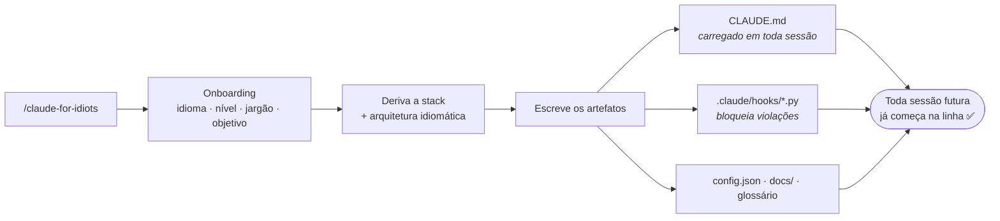

<div align="center">

# 🚲 claude-for-idiots

**Guard-rails + linguagem humana para o [Claude Code](https://claude.com/claude-code).**

*Uma skill do Claude Code que mantém o Claude **na linha** — e explica as coisas em
linguagem simples, pra que até quem nunca programou consiga construir software de
verdade sem se perder.*

[](https://github.com/JulioBarbosaS/Claude-For-Idiots/actions/workflows/ci.yml)
[](CHANGELOG.md)
[](LICENSE)
[](https://claude.com/claude-code)
[](CONTRIBUTING.md)

[English](README.md) · **Português**

</div>

---

## ⚡ Começando rápido

[](https://claude.com/claude-code)


**1. Instalar (uma vez só)**

 

```bash
git clone https://github.com/JulioBarbosaS/Claude-For-Idiots.git ~/.claude/skills/claude-for-idiots
```


```powershell
git clone https://github.com/JulioBarbosaS/Claude-For-Idiots.git "$env:USERPROFILE\.claude\skills\claude-for-idiots"
```

Depois **reinicie o Claude Code** pra ele reconhecer a nova skill.

**2. Ligar — por projeto, de forma explícita**

```
/claude-for-idiots
```

**3. Atualizar, quando sair versão nova**

```
/claude-for-idiots update
```

Atualiza a skill *e* — se o projeto atual foi configurado por ela — também os
guard-rails do projeto, **mantendo todas as escolhas que você fez**. Ele te conta
o que mudou antes de tocar em qualquer coisa.

<details>
<summary><b>📌 Antes de rodar — três avisos honestos</b></summary>

<br>

| | |
|---|---|
| ⏱️ **O setup leva ~10 min** | Ele faz as perguntas, escolhe a stack, instala as ferramentas e escreve os guard-rails. Medido no Opus 4.8. |
| 🤖 **Iniciantes: usem o auto mode** | Rode o Claude Code com aceitação automática de permissões *durante o setup*, pra não ser interrompido a cada passo. |
| 🚧 **Deploy ainda não é coberto** | A skill cobre o desenvolvimento local. Fluxos de publicação estão no roadmap. |

</details>

---

## 🤔 O que é isso? (em palavras simples)

Você está construindo algo com o Claude Code, mas:

- ele fica usando palavras que você não entende (e nem quer parar pra pesquisar), e
- você não tem certeza se ele está fazendo as coisas *"do jeito certo"*.

Essa skill resolve os dois. Quando você liga ela, o Claude:

- 🗣️ **fala com você do jeito que *você* escolher** — sem nenhum termo técnico, com os
  termos *acompanhados* de explicações simples, ou com os termos normalmente;
- 🧱 **segue boas práticas de engenharia automaticamente** — testes, commits seguros,
  uma estrutura de pastas de verdade, sem vazar senhas — pro seu projeto não virar
  uma bagunça.

Você não precisa saber o que significam *"migration"*, *"CORS"* ou *"arquitetura"*.
**Esse é exatamente o ponto.** Tanto iniciantes quanto pessoas experientes usam —
ela só se adapta.

<details>
<summary><b>💬 Como isso soa na prática</b></summary>

<br>

**Modo de termos `none`** — nunca usa jargão:

> Deixei configurado pra que suas senhas fiquem num arquivo particular no seu
> computador, que nunca sai dali. Também criei um arquivo de exemplo só com os
> *nomes* dessas configurações, pra quem for te ajudar saber o que preencher.

**Modo `explain`** — usa o termo e explica, ficando mais profundo conforme você aprende:

> Coloquei as credenciais num `.env` no gitignore — um arquivo com seus segredos que
> o Git é instruído a ignorar, então ele nunca é enviado pra internet — mais um
> `.env.example` versionado listando só os nomes das variáveis.

**Modo `raw`** — você já sabe; só quer os guard-rails:

> Segredos no `.env` (gitignored), `.env.example` versionado. Scan de segredos roda antes do push.

</details>

---

## 🧭 Como funciona

A skill é o **instalador**, não uma babá. Ela roda uma vez e escreve **artefatos
permanentes** no seu projeto — então as regras continuam valendo em toda sessão
futura, mesmo muito depois da skill sair do contexto.



| Artefato | Onde vai parar | O que faz |
|---|---|---|
| 📜 **Regras + perfil** | `CLAUDE.md` | Carregado automaticamente em toda sessão. Fonte da verdade do comportamento. |
| ⚙️ **Config** | `.claude-for-idiots/config.json` | Suas respostas do onboarding em formato legível por máquina. Lido pelos hooks. |
| 📖 **Glossário** | `.claude-for-idiots/glossary.json` | Registra quais termos já foram explicados, pra as explicações evoluírem em vez de repetir. |
| 🛡️ **Hooks** | `.claude/hooks/*.py` | Impõem tecnicamente as regras 1, 5 e 6 — eles **bloqueiam**, não só prometem. |
| 🔌 **Ligação dos hooks** | `.claude/settings.json` | Registra os hooks como `PreToolUse`. |
| 🧠 **Base de conhecimento** | `docs/INDEX.md` | Memória de longo prazo sob demanda: decisões, investigações de bug, manias de API. |

> **Por que ela só roda quando você pede.** Nem todo projeto merece guard-rails. Um
> script descartável, ou uma base de código que já existe e tem suas próprias
> convenções, geralmente é melhor deixar em paz. Por isso a skill **nunca assume o
> controle sozinha** — você liga ela, por projeto, quando realmente quer.

---

## 🛡️ O que ela garante

Depois do setup, o Claude segue isto em **toda** sessão daquele projeto.
**🔒 Checado por hook** = um script bloqueia os caminhos mais comuns de violação —
uma rede de segurança, não uma jaula. Veja "Limitações conhecidas" pro que ainda passa.

| | Regra | O que significa pra você |
|---|---|---|
| 🔒 | **Nunca edita migração na mão** | Usa o comando gerador correto em vez de remendar o histórico do seu banco. |
| 🔒 | **Arquivos novos ficam na arquitetura** | Nada jogado em qualquer canto. A estrutura de pastas sobrevive. |
| 🔒 | **Segredos nunca vão pra internet** | Chaves/senhas ficam num `.env` local; tudo que publica é varrido antes. |
| | **Sempre escreve testes** | Unitários + integração — e pergunta antes de rodar a suíte completa (que é lenta). |
| | **Commit a cada feature** | Pra você nunca perder progresso. |
| | **Sanity check depois de cada feature** | Lint → os testes da feature → subir o app de verdade pra ver funcionando. |
| | **Ferramentas de qualidade pra sua stack** | Formatador + linter instalados e configurados. Sem discussão de estilo. |
| | **Reutiliza antes de reconstruir** | Procura no código e na `docs/` antes de escrever a mesma coisa duas vezes. |
| | **Mantém um cérebro em `docs/`** | Decisões grandes e lições difíceis sobrevivem — sem inflar cada sessão. |
| | **Sabe a hora de parar de chutar** | Depois de duas correções falhas: relê o erro, confere versões, pesquisa na web e *aí* tenta de novo. |
| 🔒 | **Pausa numa feature nova** | Põe as decisões escondidas como opções pra escolher antes de escrever código. Conserto de bug, ajuste visual ou renomeação passa direto. |
| | **Consegue checar o navegador sozinho** | Em apps web: abre a página, lê o console atrás de erros escondidos, tira screenshots. *(Playwright — ele se oferece pra configurar.)* |

E ela se adapta a **você**:

- 🎚️ **Nível de experiência** — `iniciante` / `intermediário` / `avançado`: define o
  quanto ela explica e se escolhe a stack por você.
- 🗣️ **Termos técnicos** — `none` (só linguagem simples) · `explain` (o termo + uma
  explicação simples que fica mais profunda conforme você aprende) · `raw` (termos
  normalmente).

---

## 🧰 O que dá pra construir com isso?

A skill sabe escolher uma arquitetura idiomática pra esses tipos de projeto.
**Usuários avançados sempre escolhem a própria stack** — o catálogo é só o padrão.

| O que você quer construir | Stack recomendada | Por quê |
|---|---|---|
| 🌐 Site / web app |    | SSR + roteamento prontos; ecossistema gigante |
| 📄 Site estático / de conteúdo |     | Menos peças móveis pra quem está começando |
| 🔌 API REST ou serviço de backend |     | FastAPI = suave · Nest = TS estruturado |
| 🧩 App completo (UI + API + banco) |    | Uma linguagem (TS) de ponta a ponta |
| 📱 App mobile (iOS + Android) |  | Uma base de código só, tooling forte |
| ⌨️ Ferramenta de linha de comando / automação |   | Typer / Commander — pequeno, sem camadas pesadas |
| 📊 Análise de dados / protótipo de ML |     | Estilo pipeline, não estilo app |
| 🤖 Bot de Discord / Telegram |     | discord.py / aiogram — serviço pequeno |
| 🖥️ App desktop |   | Tauri = mais leve · Electron = mais familiar |

> Adicionar um novo é **editar um arquivo de dados** — veja
> [`references/stack-catalog.md`](references/stack-catalog.md). Sem reescrever a skill.

---

## ✅ Devo usar no meu projeto?

Resposta honesta: **nem sempre.** Os guard-rails têm custo — testes, checagens e
commits a cada feature — então precisam render mais do que custam.

| Projeto | Usar? |
|---|---|
| Um app/site/API de verdade que você vai continuar mexendo (semanas, meses) | ✅ **Sim** — é o ponto ideal |
| Seu primeiro projeto sério / aprender construindo algo real | ✅ **Sim** — foi feita pra isso |
| Qualquer coisa com banco de dados e/ou repositório público | ✅ **Sim** — as regras de migração e segredo existem exatamente pra isso |
| Script descartável ou experimento de uma tarde | ❌ **Não** — o Claude puro é mais rápido; o overhead não compensa |
| Base de código que já existe com convenções próprias / projeto de equipe | ❌ **Ainda não** — a skill assume projeto novo |

> 🧠 **Regra de bolso:** se o projeto ainda vai importar daqui a duas semanas, liga.
> Se é descartável, não liga.

---

## 🚧 Limitações conhecidas

Ser transparente é melhor do que te pegar de surpresa:

- **No Windows os hooks precisam de um `python3` no PATH.** O `.claude/settings.json`
  gerado chama `python3`; uma instalação do python.org entrega só `python.exe` /
  `py.exe`. Se o hook não conseguir iniciar, os guard-rails silenciosamente não
  rodam — teste com uma violação de propósito depois do setup.
- **Os hooks vigiam ferramentas de arquivo, não o shell.** Um arquivo escrito via
  `Edit`/`Write` é checado contra a arquitetura; o mesmo arquivo criado com
  `cat > arquivo` ou `sed -i` não é. Só comandos `Bash` com cara de *publicação*
  (`git push`, `npm publish`, `docker push`, …) são inspecionados.
- **O scanner de segredos é baseado em regex.** Ele lê arquivos rastreados, `.env`
  gitignorados no disco e os commits prestes a subir — mas não consegue limpar algo
  que já foi empurrado num commit anterior, e pode dar falso positivo em fixture de
  teste realista. Isente pelo `secrets.allowlist_paths` ou com um comentário
  `# cfi:allow-secret` — nunca para credencial de verdade.
- **A arquitetura é checada por extensão e glob de caminho.** Arquivo sem extensão
  nenhuma (`Dockerfile`, `Makefile`) nunca é policiado, de propósito.
- **Flutter:** arquivos de config de plataforma (`AndroidManifest.xml`, `Info.plist`,
  …) são liberados, mas código nativo de plugin em `android/`/`ios/`/`macos/` (um
  `.kt` ou `.swift` novo, `project.pbxproj`) continua sendo checado — de propósito,
  pra uma camada nativa não contornar a arquitetura Dart em silêncio.
- **A pausa de feature (Regra 10) nunca vê o seu prompt, só o arquivo sendo
  escrito.** Distinguir "feature nova" de "conserto de bug" é julgamento do Claude,
  não de um script. O hook pega um caso estreito: arquivo de código novo sem nenhum
  alinhamento registrado. Uma feature construída inteira dentro de arquivos que já
  existem passa sem pausa, por maior que seja.
- **"Isso é arquivo de teste?" é decidido por convenção de nome e pasta** (`tests/`,
  `foo_test.py`, `foo.spec.ts`, …), não pelo que o arquivo faz — deliberado, pra
  Regra 10 nunca brigar com teste-primeiro. Um arquivo que só *parece* teste é
  isento do mesmo jeito.
- **`secrets.allow_patterns` só roda em Linux/macOS.** Uma regex vinda do config
  pode entrar em backtracking catastrófico e no Windows não há como interromper
  uma que já começou, então o campo simplesmente não vale lá em vez de arriscar
  travar o hook — a mensagem de bloqueio avisa. `secrets.allowlist_paths` e o
  pragma `# cfi:allow-secret` funcionam em qualquer plataforma.
- **Bases de código já existentes e fluxos de deploy ainda não são cobertos.**

Esbarrou em alguma? [Abra uma issue](https://github.com/JulioBarbosaS/Claude-For-Idiots/issues) —
é exatamente assim que os catálogos melhoram.

---

## 🗂️ Estrutura do repositório

<details>
<summary><b>Expandir a árvore de arquivos</b></summary>

<br>

```
SKILL.md                      # o cérebro da skill (onboarding + comportamento)
VERSION                       # versão atual, registrada em cada projeto
references/                   # dados editáveis — estenda a skill AQUI
  rules.md                    #   as 10 regras (fonte da verdade)
  brainstorming.md            #   Regra 10: quando alinhar, como perguntar
  stack-catalog.md            #   objetivo → stack
  architecture-catalog.md     #   stack → arquitetura idiomática
  onboarding-flow.md          #   as perguntas
  glossary-format.md          #   como funciona o glossário do modo "explain"
  quality-tools.md            #   formatador / linter / type-checker por stack
  browser-verification.md     #   smoke test web com navegador de verdade
  update-flow.md              #   como o /claude-for-idiots update funciona
assets/                       # o que é escrito no seu projeto
  CLAUDE.template.md          #   o guia do projeto gerado
  config.example.json         #   o formato de config que os hooks leem
  settings.template.json      #   ligação dos hooks
  docs-INDEX.template.md      #   índice da base de conhecimento
  ADR.template.md             #   registro de decisão de arquitetura
hooks/                        # os guard-rails técnicos (Python, só stdlib)
  block_migration_edits.py    #   Regra 1
  enforce_architecture.py     #   Regra 5
  scan_secrets_before_push.py #   Regra 6
  require_feature_alignment.py#   Regra 10
tests/                        # 193 testes — bloqueia / permite / falha-aberto / consistência
.github/workflows/ci.yml      # roda tudo a cada push e PR
```

</details>

**Princípio de design:** *tudo foi feito pra ser editado.* Stacks, arquiteturas e o
texto das regras vivem em `references/` como **dados**, não embutidos em prosa.
Pra ensinar uma stack nova, adicione uma linha na tabela — não reescreva a skill.

---

## ❤️ Por que eu criei isso

Eu estava programando com o Claude Code e esbarrei em duas coisas que me incomodavam:

1. Ele ficava jogando palavras técnicas que eu não entendia — e, sinceramente, não
   queria parar pra aprender naquele momento.
2. Eu queria que ele simplesmente seguisse o básico de um bom software — uma
   arquitetura de verdade, testes, commits com cuidado — em vez de improvisar de um
   jeito diferente toda vez.

Então criei isso pra manter o Claude **na linha**. E, já que estava nisso, deixei
amigável o suficiente pra que alguém com **zero experiência em programação** também
consiga usar o Claude tranquilamente.

---

## 🤝 Contribuindo

Forks, issues e PRs são bem-vindos — veja **[CONTRIBUTING.md](CONTRIBUTING.md)**
(em inglês). A maioria das contribuições é **editar um arquivo de dados**, não
reescrever a skill:

| Eu quero… | Editar isto |
|---|---|
| Adicionar um tipo de projeto | [`references/stack-catalog.md`](references/stack-catalog.md) |
| Adicionar / mudar uma arquitetura | [`references/architecture-catalog.md`](references/architecture-catalog.md) |
| Mudar o texto de uma regra | [`references/rules.md`](references/rules.md) + [`assets/CLAUDE.template.md`](assets/CLAUDE.template.md) |
| Mudar as ferramentas de qualidade padrão | [`references/quality-tools.md`](references/quality-tools.md) |
| Adicionar um guard-rail novo | um script em [`hooks/`](hooks/) + um teste em [`tests/`](tests/) |

```bash
python3 -m py_compile hooks/*.py   # precisa passar
python3 tests/test_hooks.py        # precisa passar
```

---

## 📄 Licença

[MIT](LICENSE) © 2026 Julio Barbosa — permissiva e amigável a forks.

<div align="center">

**🇺🇸 [English version](README.md)**

*Se isso salvou seu projeto de virar bagunça, uma ⭐ ajuda outras pessoas a acharem.*

</div>
